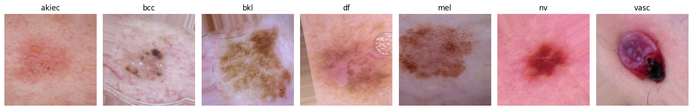
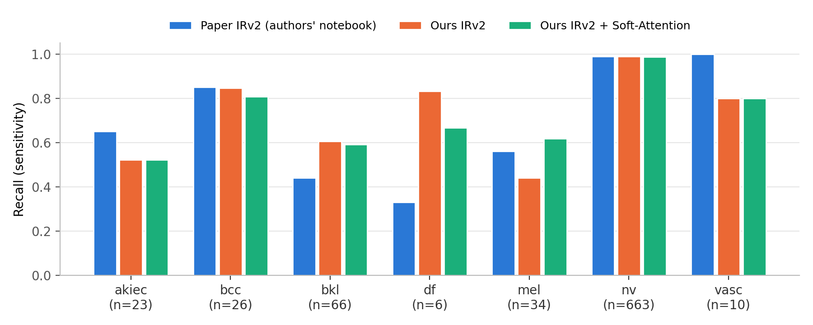
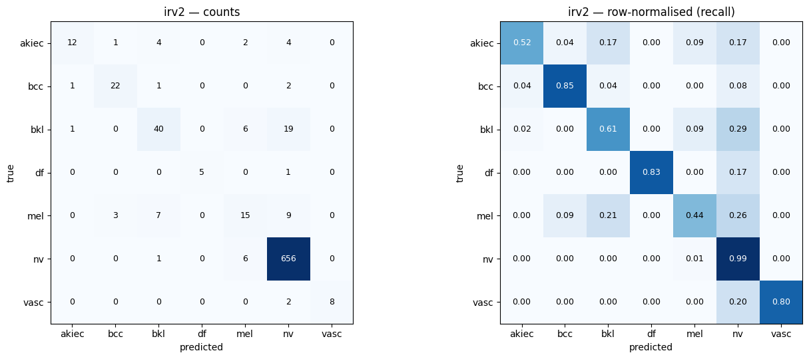
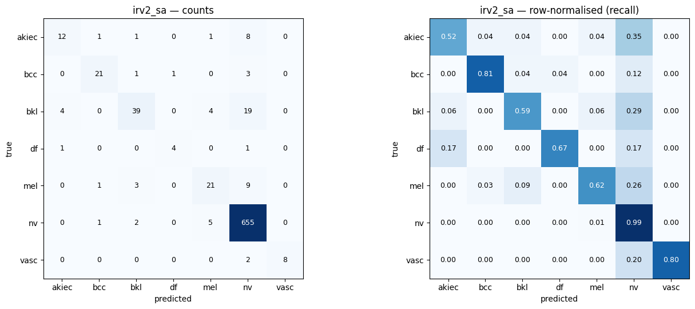
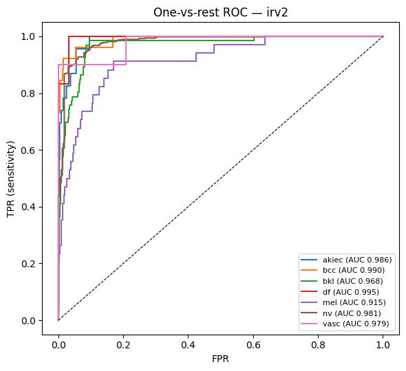
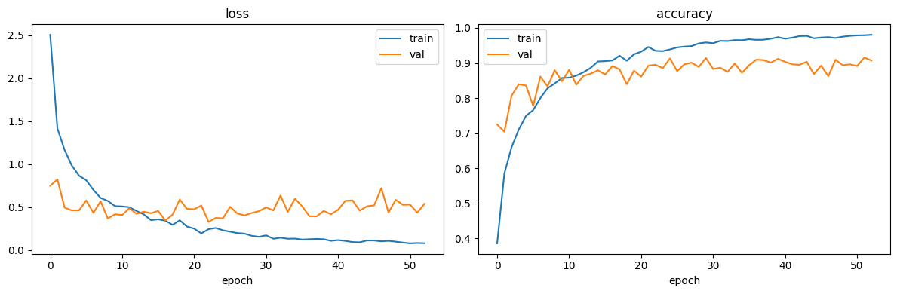
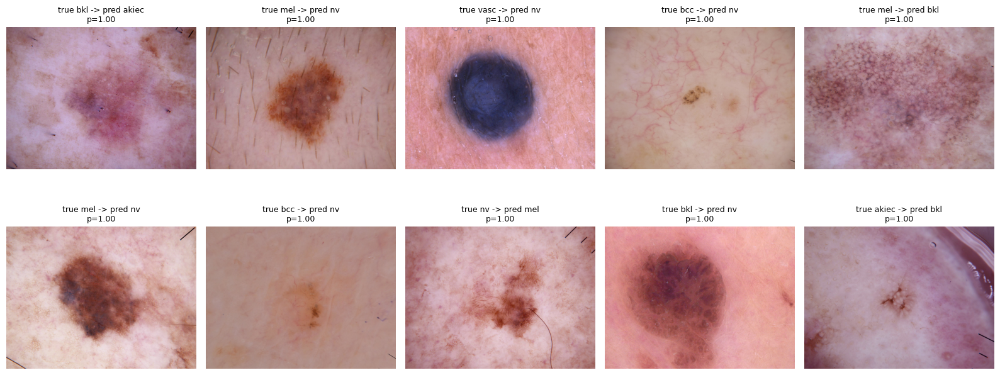

# Reproducing Soft-Attention for Multi-Class Skin Lesion Classification on HAM10000, and a Focal-Loss Hypothesis for Melanoma Recall

**Navnit Naman** (230085) · **Kanhaiya Kumar** (230062)
Newton School of Technology, Rishihood University

> Markdown version of the IEEE-format report. LaTeX source: [`report.tex`](report.tex) · PDF: [`report.pdf`](report.pdf)

---

## Abstract

We reproduce Datta *et al.*'s "Soft-Attention Improves Skin Cancer Classification Performance" (iMIMIC @ MICCAI 2021) on the seven-class HAM10000 benchmark, using the authors' public code ported to TensorFlow 2.20 / Keras 3. We match the original split (9,187 training / 828 test images), the offline augmentation (51,699 images) and both parameter counts (47,550,631 and 47,535,287) exactly. The Inception-ResNet-v2 (IRv2) baseline reproduces within 0.01 of the paper on accuracy (0.916 vs. 0.912), weighted precision (0.909 vs. 0.906) and weighted AUC (0.978 vs. 0.983). With Soft-Attention we obtain 0.913 weighted precision and 0.981 AUC against the reported 0.938 and 0.984, so the paper's +3.2-point gain from attention shrinks to +0.4 points, inside the bootstrap interval of either model. We trace the gap to an unseeded test split, very small minority classes, and checkpoint selection on the test set. The reproduction also shows the baseline's main weakness: despite 91.6 % accuracy it finds only 15 of 34 test melanomas (recall 0.44), mostly by absorbing melanoma and benign keratosis into the nevus class. Because the training set is already balanced by oversampling, we attribute this to easy examples dominating the cross-entropy gradient, and hypothesise that focal loss (γ = 2), as the only change, will raise melanoma recall to 0.50–0.60 while leaving AUC unchanged. No clinical claims are made.

**Index terms:** skin lesion classification, melanoma, HAM10000, dermoscopy, reproducibility, soft attention, focal loss, class imbalance

---

## I. Introduction

Skin cancer is among the most commonly diagnosed cancers worldwide. Melanoma accounts for only a small fraction of skin-cancer cases but for most skin-cancer deaths, and survival depends strongly on the stage at which it is detected [1]. Dermoscopy improves diagnostic accuracy over naked-eye examination, but its interpretation is subjective and requires substantial training: in a reader study, 58 dermatologists reached a mean melanoma sensitivity of only 86.6 % [4]. This has motivated a decade of work on automated classification of dermatoscopic images, beginning with the demonstration that a single ImageNet-pretrained CNN can match board-certified dermatologists on binary tasks [1].

For multi-class lesion classification, HAM10000 [2] has become the standard public benchmark. Two of its properties make published results harder to interpret than headline numbers suggest:

- **Severe class imbalance.** Melanocytic nevi make up 66.9 % of the images, while dermatofibroma and vascular lesions make up about 1 % each, so accuracy and accuracy-weighted metrics are misleading.
- **Repeated lesions.** The 10,015 images show only 7,470 distinct lesions; unless the data are split by lesion, near-duplicate views leak between training and test sets [12].

Several highly cited results do not survive these checks: some report accuracy on small or pre-augmented test subsets [13], and at least one has been retracted [16].

Against this background we chose to *reproduce* rather than to propose a new architecture. Our base paper is Datta *et al.* [8], who insert a Soft-Attention module into ImageNet-pretrained backbones and report that IRv2 with Soft-Attention reaches 93.7 % weighted precision and 98.4 % AUC on HAM10000, 3.2 points above the same backbone without attention. We selected it because it is evaluated on HAM10000, it is the only surveyed work whose public code contains both the baseline and the proposed model, and its test set is drawn from single-image lesions, which avoids lesion-level leakage. Our reproduction exposes three properties of the original protocol that the paper does not state:

- the train/test split is unseeded;
- the test set also serves as the validation set for checkpoint selection and early stopping;
- the code applies an undocumented five-fold class weight to melanoma.

**Contributions**

1. A verified reproduction of [8] on HAM10000, with exact agreement in split sizes, augmented-set size and parameter counts, and an itemised list of every porting change.
2. An analysis of the reproduction gap, showing that per-class differences are a few images each and that the claimed benefit of Soft-Attention is not distinguishable from noise under the original protocol.
3. A single-variable hypothesis (focal loss), stated with its predicted direction, magnitude and mechanism *before* implementation.
4. Reporting that follows clinical relevance: per-class sensitivity, specificity, AUC and bootstrap/Wilson confidence intervals rather than accuracy alone.

---

## II. Related Work

**Clinical benchmarks.** Esteva *et al.* [1] trained a single Inception-v3 on 129,450 clinical images and matched 21 dermatologists on biopsy-proven binary tasks. Haenssle *et al.* [4] supply the human operating point (mean sensitivity 86.6 %, specificity 71.3 % over 58 dermatologists), which is why we treat sensitivity as a primary metric. Tschandl *et al.* [7] showed that AI-assisted clinicians outperform either the AI or the clinician alone, framing such systems as decision support.

**Datasets and protocols.** HAM10000 [2] documents the multi-source acquisition and the presence of multiple images per lesion. The ISIC 2017 challenge [3] standardised fixed partitions and balanced accuracy; the ISIC 2018 Task 3 training set *is* HAM10000.

**Transfer-learning baselines.** Chaturvedi *et al.* [6] fine-tuned MobileNet (83.1 % accuracy, weighted F1 0.83). Ali *et al.* [9] fine-tuned EfficientNet B0–B7; B4 was best (87.91 %) and B6/B7 did not improve on it, indicating that capacity is not the binding constraint on HAM10000.

**Attention, imbalance and augmentation.** Datta *et al.* [8] add Soft-Attention to five backbones; IRv2+SA is best. Yao *et al.* [10] combine RandAugment, DropBlock and class-balanced losses and show a single regularised model can beat ensembles. Perez *et al.* [5] ablated 13 augmentation scenarios, our template for one-variable ablation. Lin *et al.* [17] proposed focal loss to down-weight easy examples, the mechanism behind our hypothesis. Gessert *et al.* [11] won ISIC 2019 with a multi-resolution EfficientNet ensemble, beyond our compute budget.

**Data quality and integrity.** Abhishek *et al.* [12] documented duplicates, cross-split leakage and label noise in HAM10000 derivatives. Shetty *et al.* [13] report 95.18 % on a 280-image test set built with augmentation before the split, so the number is not a valid target. "DenseNet-II" (Soft Computing, 2022) has been retracted [16] and is excluded. Rehman *et al.* [14] and the review of Naseri and Safaei [15] confirm that CNN transfer learning remains the dominant paradigm.

---

## III. Problem, Dataset and Metrics

**Task.** Given one RGB dermatoscopic image *x*, predict a label *y* from the seven HAM10000 diagnostic categories (single-label, multi-class).

**HAM10000** [2] contains 10,015 images (600 × 450) of 7,470 lesions from two centres. The largest class is about 58 times larger than the smallest.

*Table I. HAM10000 class distribution and our test-set composition.*

| Code | Diagnosis | Images | % | Test *n* |
|---|---|--:|--:|--:|
| nv | Melanocytic nevi | 6,705 | 66.9 | 663 |
| mel | Melanoma | 1,113 | 11.1 | 34 |
| bkl | Benign keratosis | 1,099 | 11.0 | 66 |
| bcc | Basal cell carcinoma | 514 | 5.1 | 26 |
| akiec | Actinic keratoses | 327 | 3.3 | 23 |
| vasc | Vascular lesions | 142 | 1.4 | 10 |
| df | Dermatofibroma | 115 | 1.1 | 6 |
| **Total** | | **10,015** | **100.0** | **828** |

**Metrics.** Following the paper we report accuracy, weighted-average precision and weighted one-vs-rest (OvR) AUC. Because nv is 80 % of the test set and dominates every weighted average, we additionally report macro precision/recall/F1, macro AUC, per-class sensitivity, specificity and AUC, 95 % bootstrap intervals (1,000 resamples of the test set) and 95 % Wilson intervals for per-class recall. **Melanoma recall is our primary clinical metric.**

---

## IV. Reproduced Method

### A. Split and augmentation
Following the official code, lesions with exactly one image form the test pool; a stratified 15 % of that pool gives the 828-image test set, and all remaining 9,187 images (including every multi-image lesion) form the training set, so no lesion appears on both sides. The authors call `train_test_split` without a seed; we fix `SEED=42`. Each training class is then augmented offline (rotation 180°, shift 0.1, zoom 0.1, horizontal/vertical flip) up to ≈8,000 images per class, giving 51,699 training images. Augmentation is applied after the split.

*Fig. 1. Offline-augmented training samples (sanity check from our run).*

### B. Models
- **Backbone.** ImageNet Inception-ResNet-v2 at 299 × 299, truncated where the authors truncate it (`layers[-28]`, an 8 × 8 × 192 map inside `block8_9`); all layers trainable.
- **Baseline head.** ReLU → Dropout(0.5) → Flatten → Dense(7, softmax). **47,550,631** parameters.
- **Soft-Attention head.** A Soft-Attention layer with 16 heads produces attention maps by a 3-D convolution over the feature tensor, softmax-normalised over spatial positions and summed; the attention-weighted features and the original features are each max-pooled (2 × 2), concatenated, and passed through ReLU → Dropout(0.5) → Flatten → Dense(7). **47,535,287** parameters. Following the code rather than the paper text, the 3-D kernel has shape (C, 3, 3) and there is no learnable scalar γ (Eq. 1 of [8] includes one).

### C. Training
Adam (lr = 0.01, ε = 0.1), categorical cross-entropy, class weight 5.0 on mel (code only, not in the paper), batch size 16, at most 150 epochs with `steps_per_epoch = len(train)/10 ≈ 919`, `ModelCheckpoint` on best validation accuracy and `EarlyStopping` on validation loss (patience 30). **Under the paper's protocol the validation set is the test set**; we reproduce this faithfully and discuss it in Section VIII.

### D. Porting changes (none alters the method)

*Table II. Changes from the official TF 2.4 code.*

| Original | Ours (TF 2.20 / Keras 3) | Reason |
|---|---|---|
| `ImageDataGenerator` to disk | Same affine transform in OpenCV; same count (51,699) | Removed in Keras 3 |
| `flow_from_directory` | `tf.data`, nearest resize, same `preprocess_input` | Speed |
| `irv2.layers[-28]` | Layer located by graph position; parameter count checked | Layer order changed |
| `keras.backend` Soft-Attention | Same computation in `tf` ops | API removed |
| No seed | `SEED=42` everywhere | Repeatability |
| 1 GPU | IRv2: 1 × T4; IRv2+SA: 2 × T4 (MirroredStrategy) | Kaggle session |

---

## V. Reproduction Results

Both runs were trained on Kaggle. IRv2 stopped at epoch 53 (best 52, ≈473 s/epoch); IRv2+SA stopped at epoch 44 (best 38, ≈467 s/epoch). The data pipeline matches the paper exactly: 10,015 images, 7,470 lesions, 9,187/828 split with identical per-class test counts, and 51,699 augmented images.

### A. Headline metrics

*Table III. Paper vs. our reproduction (828 test images). Paper values combine Tables 1 and 3 of [8] with the printed outputs of the authors' notebooks.*

| Metric | IRv2 paper | **IRv2 ours** | Gap | IRv2+SA paper | **IRv2+SA ours** | Gap |
|---|--:|--:|--:|--:|--:|--:|
| Accuracy | 0.912 | **0.916** | +0.003 | 0.935 | **0.918** | −0.017 |
| Precision (weighted) | 0.906 | **0.909** | +0.003 | 0.938 | **0.913** | −0.025 |
| Precision (macro) | 0.833 | **0.846** | +0.013 | 0.892 | **0.835** | −0.057 |
| Recall (macro) | 0.689 | **0.720** | +0.031 | 0.719 | **0.713** | −0.006 |
| F1 (macro) | – | **0.773** | | – | **0.766** | |
| AUC (weighted, OvR) | 0.983 | **0.978** | −0.005 | 0.984 | **0.981** | −0.003 |
| AUC (macro, OvR) | 0.985 | **0.973** | −0.012 | 0.985 | **0.982** | −0.003 |

*Table IV. 95 % bootstrap intervals of our runs.*

| Metric | Ours IRv2 | Ours IRv2+SA |
|---|---|---|
| Precision (weighted) | 0.887–0.932 | 0.891–0.935 |
| Recall (macro) | 0.636–0.790 | 0.627–0.793 |
| Melanoma recall | 0.267–0.618 | 0.441–0.781 |
| AUC (weighted) | 0.966–0.987 | 0.973–0.989 |

**Verdict.**

| | Result |
|---|---|
| IRv2 baseline | ✅ **Reproduced**: accuracy, weighted precision and weighted AUC within ±0.012 of the paper |
| IRv2 + Soft-Attention | ⚠️ **Partly reproduced**: AUC matches (−0.003), weighted precision 0.025 lower |
| Paper's claim: SA adds +3.2 pts weighted precision | ❌ **Not reproduced**: +0.4 pts, bootstrap intervals overlap almost completely |

### B. Per-class results

*Table V. Per-class results, ours IRv2 → ours IRv2+SA. "Correct" = correctly classified test images (paper IRv2 / ours IRv2 / ours SA).*

| Class | *n* | Correct | Precision | Recall | Specificity | AUC |
|---|--:|--:|---|---|---|---|
| akiec | 23 | 15 / 12 / 12 | .857 → .706 | .522 → .522 | .998 → .994 | .986 → .987 |
| bcc | 26 | 22 / 22 / 21 | .846 → .875 | .846 → .808 | .995 → .996 | .990 → .992 |
| bkl | 66 | 29 / 40 / 39 | .755 → .848 | .606 → .591 | .983 → .991 | .968 → .973 |
| df | 6 | 2 / 5 / 4 | 1.00 → .800 | .833 → .667 | 1.00 → .999 | .995 → .998 |
| **mel** | 34 | 19 / **15** / **21** | .517 → .677 | **.441 → .618** | .982 → .987 | .915 → .969 |
| nv | 663 | 656 / 656 / 655 | .947 → .940 | .989 → .988 | .776 → .745 | .981 → .982 |
| vasc | 10 | 10 / 8 / 8 | 1.00 → 1.00 | .800 → .800 | 1.00 → 1.00 | .979 → .975 |
| **Total** | 828 | 755 / 758 / 760 | | | | |

*Fig. 2. Per-class recall: paper IRv2 (authors' notebook output), our IRv2, and our IRv2+SA. One test image is worth 16.7 points of df recall and 10 points of vasc recall.*

*Fig. 3. Confusion matrices (counts and row-normalised recall). Top: our IRv2 baseline. Bottom: our IRv2 + Soft-Attention.*

*Fig. 4. One-vs-rest ROC curves of our IRv2 baseline. Melanoma has the lowest AUC (0.915).*

*Fig. 5. Training curves of our IRv2 baseline ("val" is the test set under the paper's protocol). Training accuracy reaches 0.98 while validation accuracy oscillates between 0.86 and 0.92.*

---

## VI. Gap and Failure Analysis

### A. Why our numbers differ from the paper
1. **A different random test set.** The authors' split is unseeded, so every execution draws a different 828 images. Our test set has the same class counts but different lesions, and the training set changes with it. This is likely the largest single effect.
2. **Tiny minority classes.** One image moves df recall by 16.7 points and vasc recall by 10 points; with macro averaging, df alone can swing macro recall by ±0.07. Our +0.031 macro recall on IRv2 comes mostly from df (5/6 vs. 2/6) and bkl (+11 images). The 95 % Wilson intervals of every per-class recall overlap the paper's.
3. **Noisy training with test-set checkpointing.** Adam at lr = 0.01 on a fully trainable 47.5 M-parameter network makes validation accuracy jump several points between consecutive epochs (Fig. 5). The checkpoint is the epoch with the best accuracy on the test set, which is ≈80 % nv, so minority-class behaviour at that epoch is close to arbitrary. Our notebook fixes the seed but does not enable deterministic GPU kernels, so repeated runs can also differ through cuDNN non-determinism; with one run per configuration, this run-to-run variance is not yet measured.
4. **A different operating point, not a worse model.** AUC is threshold-free and matches the paper closely (0.978–0.981 vs. 0.983–0.984). The models rank images about equally well; what differs is where the arg-max decision lands for each class.
5. **Software and hardware (small).** Keras 2 → 3 kernels, an OpenCV re-implementation of the same augmentation, and, for IRv2+SA only, two-GPU training with BatchNorm statistics over 8 instead of 16 images per replica.

### B. Why the Soft-Attention gain did not reproduce
The paper's +3.2 points compares one run of each model on two different unseeded test sets. Our two runs differ by +0.4 points with overlapping intervals, and with a single run per model the run-to-run variance is unknown, so a 3-point claim cannot be established from one pair of runs. Soft-Attention did change one thing: melanoma recall rose from 15 to 21 of 34, with higher melanoma precision. That is suggestive, but with only 34 test melanomas the bootstrap intervals overlap (0.27–0.62 vs. 0.44–0.78). **Under the paper's own protocol, IRv2+SA cannot be distinguished from IRv2.**

### C. What the gap is not
Not a split bug (sizes, per-class counts and the no-shared-lesion assertion all match), not an architecture difference (parameter counts are identical), and not an improvement over the paper (our small gains are within noise).

### D. Failure modes of the baseline

| True → predicted | IRv2 | IRv2+SA |
|---|--:|--:|
| bkl → nv | 19 | 19 |
| mel → nv | 9 | 9 |
| akiec → nv | 4 | 8 |
| mel ↔ bkl | 7 + 6 | 3 + 4 |
| nv → mel | 6 | 5 |

Minority lesions are absorbed into nv, and melanoma and benign keratosis, the classes most similar to nevi under dermoscopy, suffer most. Many of the most confident mistakes have *p* ≈ 1.00 (Fig. 6). The baseline also memorises the training set (training accuracy 0.98, loss 0.08) while test accuracy stays at 0.90–0.92. Melanoma ranking is reasonable (AUC 0.915) but recall at the arg-max is only 0.44.

*Fig. 6. Most confident misclassifications of our IRv2 baseline.*

---

## VII. Hypothesis and Ablation Plan

### A. Motivation
The training set is already balanced by oversampling (≈5,900–8,000 images per class), so the remaining problem is not class frequency. About 98 % of training examples end up correctly classified; their cross-entropy gradients, individually small, are numerous enough to drown out the few hard, confusable examples (mel/bkl vs. nv).

### B. Hypothesis (one variable)
> **Replacing categorical cross-entropy with focal loss (γ = 2) [17] will increase melanoma recall and macro recall on HAM10000, because focal loss down-weights well-classified training examples and concentrates the gradient on hard, confusable lesions.**

FL(p_t) = −α (1 − p_t)^γ log(p_t), which equals cross-entropy at γ = 0. We set α = 1 so that no class re-weighting is added on top of the existing ×5 melanoma weight. Every other setting (backbone, head, split, seed, augmentation, optimiser, schedule, single T4 GPU) is unchanged. We apply the change to the baseline without Soft-Attention, because attention gave no measurable gain in our reproduction.

**Mechanism.** An example predicted correctly at p = 0.9 contributes −log 0.9 ≈ 0.105 under cross-entropy but 0.01 × 0.105 ≈ 0.001 under focal loss, 100 × less; a hard example at p = 0.3 keeps about half its loss. The gradient therefore shifts to the mel/bkl/akiec images the network still confuses with nv, moving the decision boundary away from nv. We do not expect better ranking, so AUC should stay flat while recall rises.

### C. Predictions (vs. our reproduced IRv2, mean over seeds)
- Melanoma recall: 0.44 → **0.50–0.60** (+2 to +5 of 34)
- Macro recall: 0.72 → **0.74–0.77**
- bkl recall: 0.61 → 0.65–0.72; bkl → nv errors 19 → ≤ 14
- Weighted precision unchanged to slightly lower (0.89–0.91); accuracy may dip by ≤ 0.01; nv recall ≈ 0.97–0.98
- Weighted AUC unchanged (± 0.005)

### D. Falsification criteria
- **Reject** if mean melanoma recall over seeds does not exceed the baseline mean by more than one standard deviation.
- **Reject** if macro recall improves only through df/vasc (6 and 10 images).
- **Partial support** if recall rises but weighted precision falls by more than 0.02, since a threshold change could produce the same trade-off.

### E. Risks
| Risk | Mitigation |
|---|---|
| Run-to-run noise may be as large as the predicted effect (unmeasured; one run per config so far) | ≥ 3 seeds (42, 7, 2024); report mean ± std |
| Focal-loss values are smaller than CE, and Adam's ε = 0.1 makes it not scale-invariant, so the effective step size changes | Compare training curves; note as a confound |
| Checkpoint still picked on the test set | Add one run with a lesion-grouped validation split |
| Recall gains may cost nv specificity | Track nv recall and specificity |

*Table VI. Ablation plan (Milestone 4). Predictions written before running.*

| Configuration | Seeds | mel recall | macro recall | W. precision | W. AUC |
|---|--:|--:|--:|--:|--:|
| IRv2, CE (reproduced) | 42 | 0.441 | 0.720 | 0.909 | 0.978 |
| **IRv2, focal γ = 2** | 3 | *0.50–0.60* | *0.74–0.77* | *0.89–0.91* | *≈ 0.978* |
| IRv2 + SA (reproduced) | 42 | 0.618 | 0.713 | 0.913 | 0.981 |
| IRv2, focal, clean validation | 42 | – | – | – | – |

**Alternatives considered.** CLAHE preprocessing (our errors are semantic confusions, not low contrast); a backbone swap to EfficientNet-B0 (changes capacity and preprocessing at once, and [9] shows capacity is not the bottleneck); class-balanced sampling (training is already balanced); removing the test-as-validation leak (an evaluation fix, reported as a side experiment).

**Compute.** One run takes ≈53 epochs × ≈8 min ≈ 7 GPU-hours on a Kaggle T4; with ≈30 GPU-hours per week we plan about four runs per week, starting with focal loss at seed 42 for direct comparison.

---

## VIII. Limitations

Under the paper's protocol the test set is also the validation set: it drives checkpoint selection and early stopping, so every number in this report, the paper's and ours, is optimistically biased. Each configuration was run once (seed 42), so run-to-run variance is unmeasured; multi-seed results are planned for Milestone 4. The test set contains only 6 df and 10 vasc images, so per-class estimates for those classes are fragile. Drawing the test set from single-image lesions avoids leakage but may bias it towards easier lesions. The IRv2+SA run used two GPUs, a small deviation in BatchNorm statistics. HAM10000 comes from two centres and a predominantly fair-skinned population, so results should not be assumed to generalise across skin tones or acquisition settings.

**No clinical claims are made.** Nothing here is validated for diagnostic use; the models are not medical devices, and all metrics are benchmark results on a curated research dataset. Consistent with [7], the appropriate framing is decision support for a qualified clinician.

## IX. Conclusion

We reproduced Datta *et al.*'s Soft-Attention pipeline on HAM10000 with an exact match in split, augmentation and model size. The IRv2 baseline reproduces within 0.01 on the paper's headline metrics, but the reported 3.2-point gain from Soft-Attention shrinks to 0.4 points, which is indistinguishable from run-to-run noise under the original protocol. The reproduction shows that the baseline's real weakness is melanoma recall (0.44), driven by minority lesions being absorbed into the nevus class. We hypothesise that focal loss, as a single controlled change, will raise melanoma recall to 0.50–0.60 without changing AUC, and we will test this over multiple seeds in Milestone 4.

## Code and Data Availability

- Our notebooks, outputs and this report: <https://github.com/kanhaiyak23/skin-lesion-soft-attention-reproduction>
- Original code: <https://github.com/skrantidatta/Attention-based-Skin-Cancer-Classification>
- HAM10000: Harvard Dataverse; Kaggle mirror `kmader/skin-cancer-mnist-ham10000`

---

## References

1. A. Esteva, B. Kuprel, R. A. Novoa, J. Ko, S. M. Swetter, H. M. Blau, and S. Thrun, "Dermatologist-level classification of skin cancer with deep neural networks," *Nature*, vol. 542, no. 7639, pp. 115–118, 2017.
2. P. Tschandl, C. Rosendahl, and H. Kittler, "The HAM10000 dataset, a large collection of multi-source dermatoscopic images of common pigmented skin lesions," *Scientific Data*, vol. 5, art. 180161, 2018.
3. N. C. F. Codella *et al.*, "Skin lesion analysis toward melanoma detection: A challenge at the 2017 International Symposium on Biomedical Imaging (ISBI), hosted by the International Skin Imaging Collaboration (ISIC)," in *Proc. IEEE ISBI*, 2018, pp. 168–172.
4. H. A. Haenssle *et al.*, "Man against machine: diagnostic performance of a deep learning convolutional neural network for dermoscopic melanoma recognition in comparison to 58 dermatologists," *Annals of Oncology*, vol. 29, no. 8, pp. 1836–1842, 2018.
5. F. Perez, C. Vasconcelos, S. Avila, and E. Valle, "Data augmentation for skin lesion analysis," in *ISIC Skin Image Analysis Workshop, MICCAI*, LNCS, Springer, 2018, pp. 303–311.
6. S. S. Chaturvedi, K. Gupta, and P. S. Prasad, "Skin lesion analyser: An efficient seven-way multi-class skin cancer classification using MobileNet," in *AMLTA 2020*, AISC vol. 1141, Springer, 2020, pp. 165–176.
7. P. Tschandl *et al.*, "Human–computer collaboration for skin cancer recognition," *Nature Medicine*, vol. 26, no. 8, pp. 1229–1234, 2020.
8. S. K. Datta, S. M. A. Hashemi, S. N. Srihari, and M. Gao, "Soft-attention improves skin cancer classification performance," in *iMIMIC, MICCAI Workshops*, LNCS vol. 12929, Springer, 2021, pp. 13–23.
9. K. Ali, Z. A. Shaikh, A. A. Khan, and A. A. Laghari, "Multiclass skin cancer classification using EfficientNets — A first step towards preventing skin cancer," *Machine Learning with Applications*, vol. 5, art. 100036, 2021.
10. P. Yao *et al.*, "Single model deep learning on imbalanced small datasets for skin lesion classification," *IEEE Trans. Medical Imaging*, vol. 41, no. 5, pp. 1242–1254, 2022.
11. N. Gessert, M. Nielsen, M. Shaikh, R. Werner, and A. Schlaefer, "Skin lesion classification using ensembles of multi-resolution EfficientNets with meta data," *MethodsX*, vol. 7, art. 100864, 2020.
12. K. Abhishek, A. Jain, and G. Hamarneh, "Investigating the quality of DermaMNIST and Fitzpatrick17k dermatological image datasets," *Scientific Data*, vol. 12, 2025.
13. B. Shetty, R. Fernandes, A. P. Rodrigues, R. Chengoden, S. Bhattacharya, and K. Lakshmanna, "Skin lesion classification of dermoscopic images using machine learning and convolutional neural network," *Scientific Reports*, vol. 12, art. 18134, 2022.
14. M. Z. U. Rehman, F. Ahmed, S. A. Alsuhibany, S. S. Jamal, M. Z. Ali, and J. Ahmad, "Classification of skin cancer lesions using explainable deep learning," *Sensors*, vol. 22, no. 18, art. 6915, 2022.
15. H. Naseri and A. A. Safaei, "Diagnosis and prognosis of melanoma from dermoscopy images using machine learning and deep learning: a systematic literature review," *BMC Cancer*, vol. 25, art. 75, 2025.
16. "Retraction Note: DenseNet-II: an improved deep convolutional neural network for melanoma cancer detection," *Soft Computing*, 2026. [Retracted article originally published 2022.]
17. T.-Y. Lin, P. Goyal, R. Girshick, K. He, and P. Dollár, "Focal loss for dense object detection," in *Proc. IEEE ICCV*, 2017, pp. 2980–2988.
